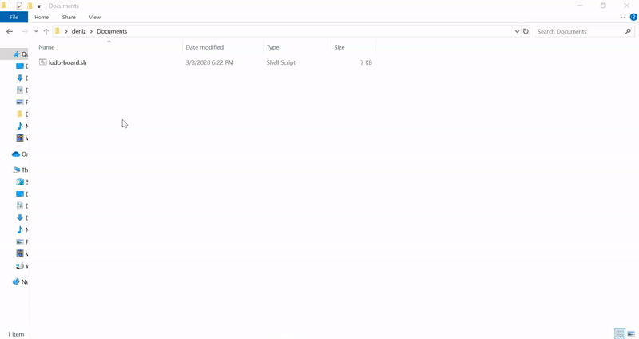

# 🎨 Drawing Ludo Board With ShellScript 

*You need to swith to **fullscreen** on your terminal before running the .sh file. Then, after making sure you are in the same directory with the **ludo-board.sh** file, you can see the result using the command below.*

    sh ludo-board.sh

